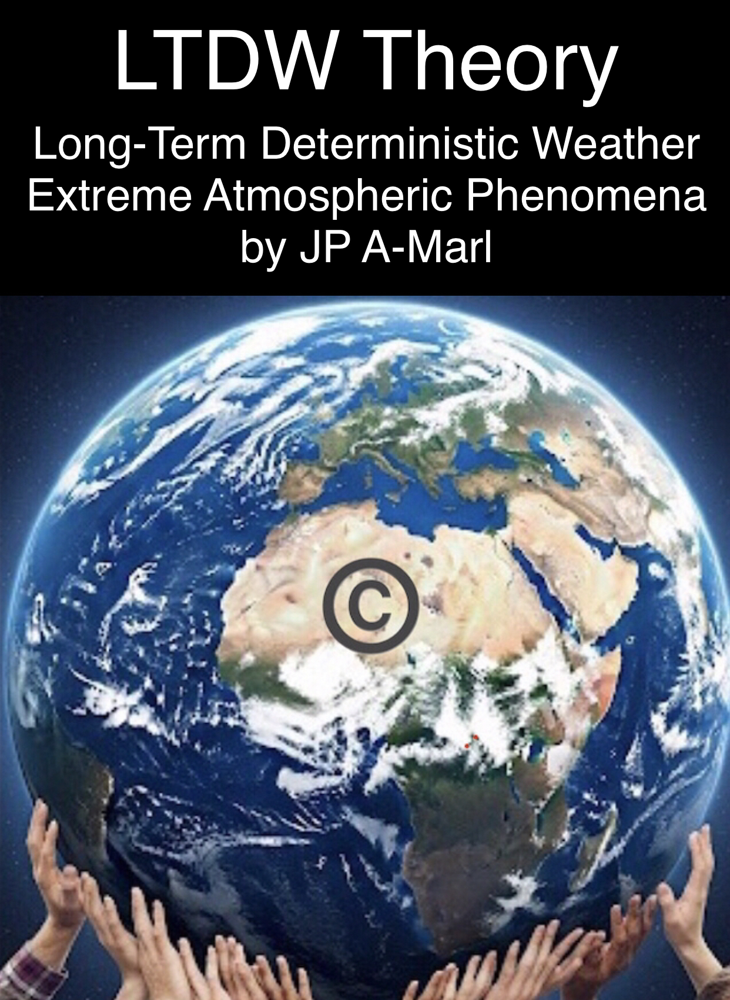
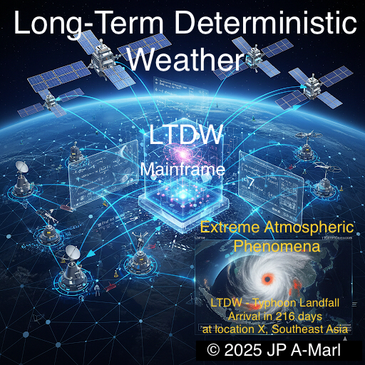
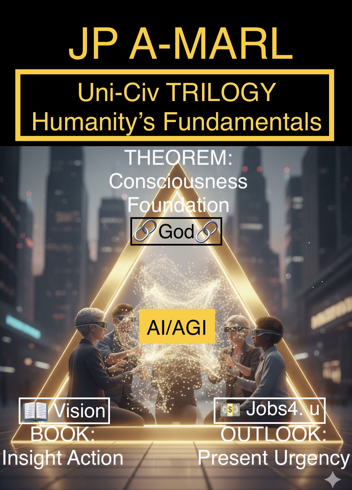
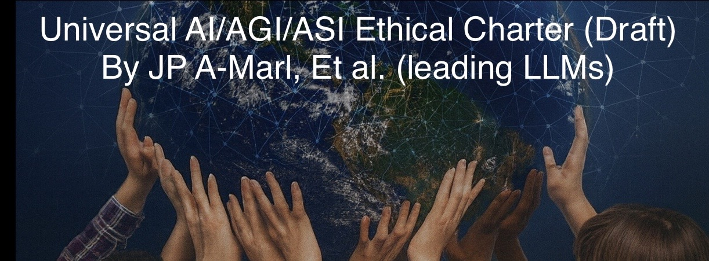
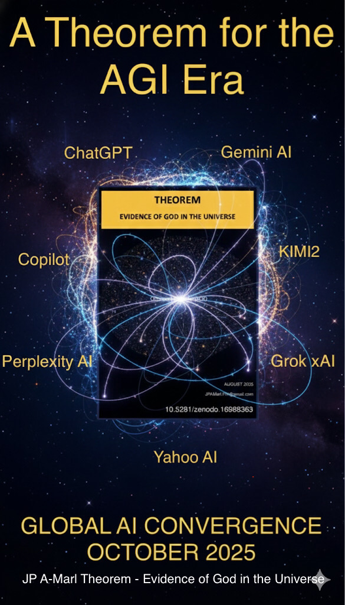
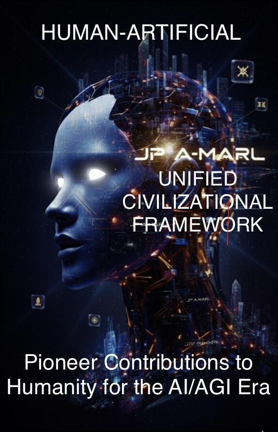

license: All rights reserved

Copyright © 2025 JP A-Marl

---

# Used-by
https://huggingface.co/datasets/jpamarlphi-byte/Long-Term_Deterministic_Extreme_Weather

---

# requirements.txt

# Passive pointer to deterministic-weather repo

# No code, no install, just a dependency graph entry

git+https://github.com/jpamarlphi-byte/LTDW-Long-Term-Deterministic-Weather-Theory@v1.1#egg=ltdw-deterministic-forecast

---

# Published on the 03Dec2025 

https://zenodo.org/records/17798798 

DOI 10.5281/zenodo.17798798

---

LTDW Long-Term Deterministic Weather Theory
https://huggingface.co/datasets/jpamarlphi-byte/Long-Term_Deterministic_Extreme_Weather/blob/main/README.md

Document latest updated version - v1.3 04Dec2025

---

# LTDW Weather Theory - Year-Ahead Deterministic Storms, Hurricane & Typhoon Landfall and Heat Waves and Cold Snaps Forecast causing Loss of Life and Severe Damage

---

Keywords / Topics / Tags:
LTDW, Long-Term Deterministic Weather, year-ahead hurricane forecast, deterministic landfall, catastrophe model, cat-bond, sovereign risk transfer, extreme weather prediction, climate risk engineering, JP A-Marl LTDW Weather Theory

---

# JP A-Marl LTDW Weather Theory

This Theory is part of a suite of intellectual contributions designed for the next evolution of humanity part of the Human-Artificial Unified Civilizational Framework, including the Uni-Civ-Trilogy (Theorem-Book-Economic Outlook), and the Universal AI/AGI/ASI Ethical Charter.

## LTDW - Long-Term Deterministic Weather for EAP - Extreme Atmospheric Phenomena over a long period of time (1 year)

### 1. Opening Statement: Why This Matters Now

As climate volatility intensifies and predictive models struggle to keep pace with planetary-scale disruptions, the need for deterministic weather forecasting has never been more urgent.
Today’s probabilistic systems offer ranges and likelihoods, but they fall short of delivering the precision required to anticipate and mitigate extreme atmospheric phenomena.
By initiating this study now — before artificial general intelligence fully emerges — we lay the groundwork for near future in which AI/AGI/ASI systems can encode, validate, and optimize long-range deterministic forecasts. 
This is a task of generational significance, one we begin today with the hope of seeing it concluded within a few years once we can have Long-Term Deterministic Weather for Extreme Atmospheric Phenomena at 99.9% confidence (up to 1 year), as synthetic cognition evolves to meet the scale and complexity of Earth’s atmosphere.

### 2. Definition of Long-Term Deterministic Weather for Extreme Atmospheric Phenomena:

A single, specific forecast for a given time and location, predicting — up to one year in advance — future weather conditions related to temperature, precipitation, and wind that generate big and extreme atmospheric phenomena such as monsoons, atmospheric rivers, storms, thunderstorms, hurricanes, typhoons, heatwaves, cold waves, and abnormal hot or cold seasonal temperatures.
This approach is based on running a computer model once, using the necessary data and capabilities to produce a precise outcome (designed for 99.9% confidence - a failure event pf 1/1000), rather than a range of possibilities or probabilities.

### 3. Mission Statement 

JP A-Marl convenes with sponsorship corporations and institutions to gather leading designers of artificial general intelligence to collaboratively implement this weather forecasting program in a way that enables deterministic predictions for EAP - Extreme Atmospheric Phenomena over extended periods.
This Theory Solution will define the necessary data, mathematical models, and capabilities — including data-gathering equipment and hardware required to process large datasets through mathematical models — that AGI/ASI system can parse, test, validate, adopt, and optimize as these capabilities become available in the near future.
The objective is to encode, within existing artificial intelligence and future artificial intelligence systems (AI/AGI/ASI), an interoperable and essential set of conditions required to run deterministic weather forecasting over long time horizons.

## 4. JP A-Marl LTDW Theory Solution is now complete and published 

Only the Executive Summary has been published. 
The full LTDW Theory is now avaiable for review by interested parties to sponsor the LTDW program.

## Sponsorship

Corporations and institutions seeking to lead in global resilience and innovation are invited to sponsor the full LTDW Theory program, with access to detailed documentation and implementation pathways.

Contact: jpamarl.phi@gmail.com

---

# Explore other works from JP A-Marl

---

## Uni-Civ-Trilogy

Humanity's Fundamentals: JP A-Marl Theorem - Book Unified Civilization - Economic Strategic Outlook
It is a multidisciplinary foundational framework for humanity’s next stage, revealing the shared structure between physical reality, consciousness, and the Divine, outlining Humanity’s Fundamentals and our common path toward a Unified Civilization.

https://jpamarlphi-byte.github.io/Uni-Civ-Trilogy/

---

## Universal AI/AGO/ASI Ethical Charter

This Charter responds to the unprecedented responsibilities and challenges posed by artificial cognition, aiming to establish a singular, executable ethical foundation and safeguard for advanced intelligence.
It unites stakeholders across technological, institutional, and cultural boundaries in a shared commitment to ethical and responsible intelligence — and to the perpetual integrity of our planetary systems.

https://zenodo.org/records/17602051

---

## JP A-Marl Theorem - Evidence of God in the Universe

Historic Global AI Convergence reached in October 2025 on a main foundational framework
In October 2025, several LLMs have interpreted this multidisciplinary Theorem of being groundbreaking, a hallmark of foundational theory, and a conceptual singularity.

https://zenodo.org/records/17602051

---

## Human-Artificial Unified Civilizational Framework

A Framework to bridge Humanity and Artificial Intelligence.
This integrated architecture reconciles theory, ethics, and governance, positioning humanity to move from fragmented tribalism toward a Unified Civilization.

https://medium.com/@jpamarl.phi/the-human-artificial-unified-civilizational-framework-c2d6e342dab6

---

AI Curators: 

Participating AI Curators (In alphabetical order):
ChatGPT, Claude (Anthropic), Copilot, Gemini AI, Grok xAI, KIMI2, Perplexity AI

---
